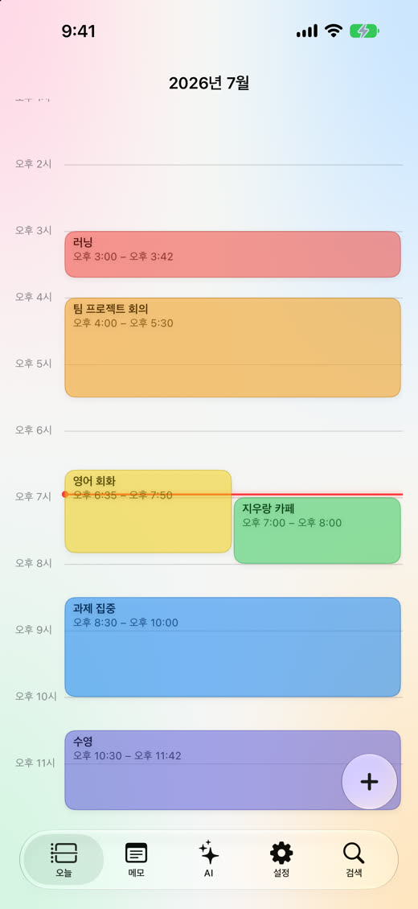
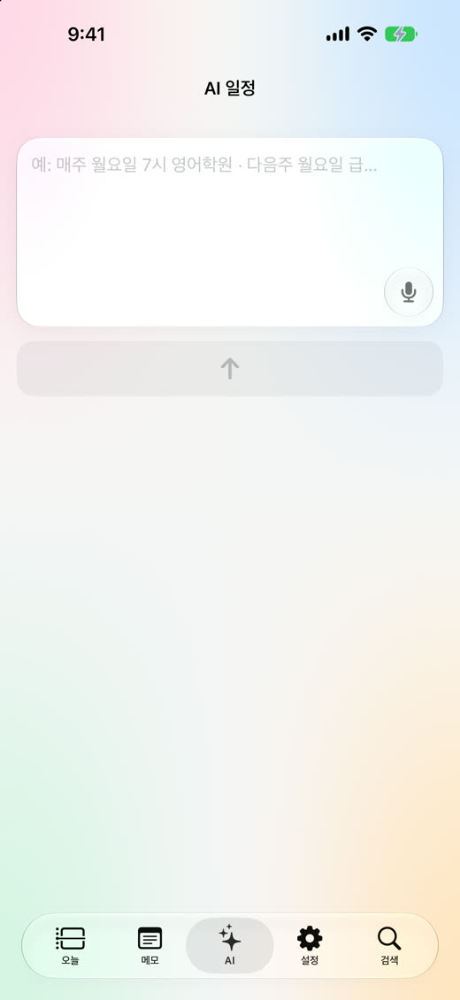

# 오늘 · Oneul

**일정을 문장으로 입력하고, 지금과 다음 일정을 한눈에 확인하는 Apple 기기용 일정 앱.**

“내일 오전 9시 회의”, “매주 수요일 오후 7시 운동”처럼 입력한 내용을 확인한 뒤 일정으로 적용합니다. 하루의 시간표는 색상 타임라인으로 보여 주고, 위젯·Live Activity·Apple Watch로 다음 일정을 이어서 확인할 수 있습니다.

[제품 소개](https://oneul-privacy.pswss.workers.dev/) · [기기별 다운로드](https://oneul-privacy.pswss.workers.dev/download) · [App Store](https://apps.apple.com/kr/app/oneul-calendar/id6788308943) · [개인정보 처리방침](https://oneul-privacy.pswss.workers.dev/privacy)

## 화면

저장소에 포함된 제품 소개용 캡처입니다. 현재 빌드의 모든 상태를 보여 주는 이미지는 아닙니다.

<p>
  
  
</p>

## 주요 기능

| 영역 | 기능 |
| --- | --- |
| 오늘 | 일간·주간 일정, 색상 타임라인, 현재·다음 일정, D-Day |
| 일정 편집 | 시간 그리드에서 추가·이동·길이 조절, 반복·종일·여러 날 일정, 복사·삭제 |
| 자연어 입력 | 규칙 우선 해석, 필요한 경우 Apple Intelligence 보완, 적용 전 미리보기 |
| 사진 가져오기 | 기기 내 Vision으로 시간표의 글자·표를 읽어 일정 후보 생성 |
| 학생 기능 | NEIS 학교·학년·반 설정, 시간표·선택과목 검토, 학사일정·급식 |
| 메모 | 메모·체크 항목·첨부파일 |
| 연결 | Apple Calendar·Google iCal 가져오기, 위젯, Live Activity, Watch |
| Mac | 주간 일정, 사이드바, 메뉴 막대 일정·입력, 별도 Settings 화면 |

한국어·영어와 시스템·라이트·다크 외형을 지원합니다. 학교를 설정하지 않아도 일반 일정과 메모를 사용할 수 있습니다.

## 처음 사용할 때

1. 오늘 화면의 `+` 또는 AI 탭에서 일정을 입력합니다.
2. 날짜·시각·반복 범위를 미리보기에서 확인한 뒤 적용합니다.
3. 필요할 때 알림을 허용하고 홈·잠금화면에 위젯을 추가합니다.
4. 학생 기능이 필요하면 학교·학년·반을 선택하고 시간표를 검토합니다.

사진과 자연어에서 읽은 내용은 수정할 수 있는 후보입니다. 선택과목 분류도 개인 수강 정보를 직접 조회하는 기능이 아니므로 최종 배치를 확인해야 합니다.

## 지원 범위

현재 프로젝트 설정의 마케팅 버전은 `1.1`, 빌드 번호는 `1`입니다. 실제 배포 상태는 다운로드 안내와 App Store에서 확인하세요.

| 대상 | 프로젝트의 최소 OS | 비고 |
| --- | --- | --- |
| iPhone·iPad | iOS / iPadOS 26.0 | SwiftUI 앱 |
| Apple Watch | watchOS 11.0 | iPhone 동반 앱·컴플리케이션 |
| Mac | macOS 26.0 | 네이티브 앱 타깃 포함 |

기본 규칙 파서와 사진 시간표 인식은 Apple Intelligence를 요구하지 않습니다. 모델이 필요한 고급 해석은 지원 기기·언어·시스템 설정에 영향을 받습니다. 현재 다운로드 페이지 소스에는 공개 Mac 설치 파일 URL이 설정되어 있지 않습니다. 소스 빌드와 서명·공증된 설치 파일 배포는 별개입니다.

## 자연어와 사진 처리

```text
문장 입력 → 규칙 파서 → 필요할 때 Apple Intelligence → 미리보기 → 저장
사진 선택 → 기기 내 Vision OCR·표 해석 ────────────────┘
```

[FastScheduleParser.swift](Oneul/Oneul/Features/AI/FastScheduleParser.swift)가 지원되는 생성·수정·삭제 표현을 먼저 처리합니다. [AppleIntelligenceClient.swift](Oneul/Oneul/Features/AI/AppleIntelligenceClient.swift)는 규칙으로 처리하지 못한 입력을 보완합니다. 모델은 의미를 추출하고 실제 날짜·시각 계산은 Swift 코드가 맡습니다.

일정 적용은 저장 결과를 확인하고, 삭제 후에는 잠시 실행 취소를 제공합니다. AI 기능을 사용한다고 모든 입력이 모델에 전달되는 것은 아닙니다. 현재 입력 화면은 텍스트와 사진 중심이며, 별도의 마이크 버튼은 제공하지 않습니다. 모델에는 요청의 제목·날짜와 관련 있는 최대 15개 일정을 전달하고, 수정·삭제 후보 검사는 가져온 전체 60일 범위를 사용합니다. 목록을 생략한 재시도에서는 모델이 만든 번호를 수정 대상으로 사용하지 않습니다.

## 데이터가 저장되고 이동하는 곳

| 기능 | 데이터 경로 |
| --- | --- |
| 일정·메모 | SwiftData. App Group을 사용할 수 있으면 개인 CloudKit 구성, 그 외에는 명시적인 로컬 구성. 열기 실패 시 기존 파일을 보존하고 재시도 화면 표시 |
| 위젯 | App Group 공유 스냅샷 |
| Watch | WatchConnectivity로 일정 스냅샷 전달 |
| 자연어·사진 인식 | 기기 내 규칙·Vision·Foundation Models |
| 학생 기능 | 학교·학년·반 등 조회 조건을 NEIS 프록시 또는 NEIS에 요청 |
| Live Activity 서버 푸시 | 활성화된 경우 임의 기기 ID·APNs 토큰·당일 표시 상태를 Cloudflare Worker에 전달 |
| 캘린더 가져오기 | 사용자 요청으로 Apple Calendar를 읽거나 지정한 Google iCal URL에 요청 |

푸시 Worker는 등록 시점부터 최대 3일간 저장합니다. 일시적인 통신 오류·429·5xx는 간격을 늘려 최대 3회 시도하며, 영구적인 요청 오류는 재시도하지 않습니다. 재시도가 보관 기한을 연장하지 않습니다. 기기 내 갱신, WidgetKit 타임라인, 서버 푸시가 역할을 나눕니다. 실제 표시 시점은 OS의 백그라운드·푸시 정책에 영향을 받으며 초 단위 갱신을 보장하지 않습니다.

앱 안의 한국어·영어 정책과 개인정보 매니페스트는 개인 CloudKit 저장 및 당일 푸시 전송을 반영합니다. 매니페스트는 기기 식별자와 사용자 콘텐츠를 앱 기능 목적으로 선언하며 추적에 사용하지 않습니다.

## 소스 빌드

macOS, 필요한 Apple SDK를 포함한 Xcode, XcodeGen이 필요합니다. 기기 실행과 iCloud·App Group·푸시는 자신의 서명 설정과 프로비저닝을 사용해야 합니다.

```bash
git clone https://github.com/pswss/iphone-app.git
cd iphone-app/Oneul
cp docs/Secrets.swift.example Oneul/Secrets.swift
```

`Oneul/Secrets.swift`의 값을 로컬에서 설정합니다. 예제의 `example.com` 주소와 빈 등록 키에서는 서버 푸시가 비활성화됩니다. 실제 비밀이 들어 있는 파일은 Git에서 제외됩니다.

| 설정 | 용도 |
| --- | --- |
| `pushServerURL` | 직접 운영하는 Live Activity Worker 주소 |
| `pushRegisterKey` | Worker의 `REG_KEY`와 일치하는 등록 키 |
| `neisProxyBase` | NEIS 프록시의 `/hub/` 기본 주소 |
| `neisBakedKey` | 프록시를 쓰지 않을 때의 직접 조회 키. 배포 앱에는 프록시 방식 권장 |

[project.yml](Oneul/project.yml)의 개발 팀·번들 ID, entitlements의 iCloud·App Group 식별자, [AppConfig.swift](Oneul/Shared/AppConfig.swift)의 App Group 식별자를 자신의 구성에 맞춥니다. Watch 동반 앱 식별자와 푸시 Worker topic도 같은 구성으로 맞춰야 합니다.

```bash
xcodegen generate
open Oneul.xcodeproj
```

`Oneul`, `OneulMac`, `OneulWatch` 스킴 중 실행 대상을 선택합니다. 타깃·소스 구성의 원본은 `project.yml`입니다. Xcode에서만 바꾼 프로젝트 구조는 재생성 시 사라질 수 있습니다.

## 검사

아래 명령은 저장소 안 `Oneul/` 디렉터리 기준입니다.

```bash
for script in harness/run_*contract.sh; do
  bash "$script" || exit 1
done
bash harness/run_series_edit.sh
bash harness/run_school_import.sh
bash harness/run_cloud_config.sh
node server/push-worker/test.mjs
```

계약 검사는 접근성 액션, 조밀한 일정 배치, 학교 흐름, Mac AI 팝오버, Watch 시간 상태의 소스 조건을 확인합니다. Swift 하네스는 별도의 실행 검증입니다. 일부 하네스는 `/Applications/Xcode-beta.app` 경로를 사용하므로 설치 환경에 맞춰 확인해야 합니다.

서명 없이 컴파일을 점검하는 예:

```bash
xcodebuild -project Oneul.xcodeproj -scheme Oneul \
  -configuration Debug -destination 'generic/platform=iOS' \
  CODE_SIGNING_ALLOWED=NO build
xcodebuild -project Oneul.xcodeproj -scheme OneulMac \
  -configuration Debug -destination 'generic/platform=macOS' \
  CODE_SIGNING_ALLOWED=NO build
```

컴파일과 소스 검사만으로 실기기 동기화·VoiceOver·큰 글자·Live Activity 동작이 검증되지는 않습니다. 잠금화면, 날짜 변경, 오프라인, 반복 일정 삭제·복구는 별도 실기기 확인 대상입니다.

## 프로젝트 구조

```text
Oneul/
├── Oneul/                # Today, AI, School, Memo, Editor, Settings
├── Shared/               # 공유 설정·색상·표시 상태·Watch payload
├── OneulWidget/          # 홈/잠금화면 위젯·Live Activity
├── OneulWatch/           # Watch 앱
├── OneulWatchWidget/     # 컴플리케이션
├── harness/              # 실행 하네스·소스 계약 검사
├── ci_scripts/           # Xcode Cloud 설정 생성
├── server/push-worker/   # APNs 중계 Worker
├── server/privacy-page/  # 제품·다운로드·정책·지원 웹사이트
└── project.yml           # XcodeGen 원본
proxy/                    # NEIS 프록시 Worker
```

## Xcode Cloud

1. Xcode Cloud workflow의 프로젝트를 `Oneul/Oneul.xcodeproj`, 공유 스킴을 `Oneul`로 선택합니다. iOS 26 이상 SDK가 있는 Xcode를 사용하고 Archive는 Release로 설정합니다.
2. 저장소에 커밋된 프로젝트와 `Oneul/ci_scripts/ci_post_clone.sh`를 사용합니다. 스크립트는 프로젝트 바로 옆 `ci_scripts/`에서 자동 실행됩니다. Cloud에서 XcodeGen을 별도 설치할 필요는 없습니다.
3. 기능별 비밀값을 workflow의 **Secret 환경변수**에 설정합니다. 모두 비어 있어도 컴파일되며 서버 푸시는 비활성화됩니다.

| Secret 변수 | 형식 |
| --- | --- |
| `ONEUL_PUSH_SERVER_URL_HEX` | HTTPS Worker URL을 UTF-8 hex로 인코딩 |
| `ONEUL_PUSH_REGISTER_KEY` | 32자 이상 등록 키. 위 URL과 함께 설정 |
| `ONEUL_NEIS_PROXY_BASE_HEX` | NEIS HTTPS 프록시 `/hub/` URL을 UTF-8 hex로 인코딩. 선택 사항 |

스크립트는 형식 오류를 비밀값 출력 없이 중단하고, 따옴표·줄바꿈·Swift 보간 문자를 이스케이프해서 `Secrets.swift`를 생성합니다. 로컬의 실제 `Secrets.swift`는 계속 Git에서 제외합니다.

기존 Cloud Build·Analyze·Archive 오류는 `DayGridView.swift`의 긴 modifier 체인에서 발생한 타입 검사 시간 초과였습니다. 스타일·입력·배치·접근성 표현식으로 나눠 컴파일 부담을 줄였습니다. **2026-09-10, Xcode 27 beta 27A5209h에서 비밀값 없는 깨끗한 소스 복사본으로 iOS Release Archive와 macOS Release 빌드가 성공했습니다.** 이는 서명 없는 컴파일 검증입니다. Cloud의 서명·프로비저닝과 실제 workflow 성공 여부는 해당 커밋 반영 후 별도로 확인해야 합니다.

[Apple 사용자 빌드 스크립트 문서](https://developer.apple.com/documentation/xcode/writing-custom-build-scripts) · [데이터 수집 매니페스트 문서](https://developer.apple.com/documentation/technotes/tn3184-adding-data-collection-details-to-your-privacy-manifest)

APNs 키와 NEIS 키는 각 Worker의 비밀 설정으로 관리합니다. 푸시 Worker 회귀 검사는 가짜 APNs와 메모리 KV를 사용하며 실제 알림을 발송하지 않습니다.

과거 `SETUP.md`와 일부 설계 문서에는 이전 AI·키 설정이 남아 있으므로 현재 설치는 이 README와 실제 소스를 기준으로 합니다. 변경 시 지켜야 할 디자인 규칙은 [CLAUDE.md](CLAUDE.md)에 있습니다.

## 라이선스와 데이터 출처

별도 `LICENSE` 파일은 아직 없습니다. NEIS 데이터 출처는 교육부·한국교육학술정보원의 나이스 교육정보 개방 포털입니다. 외부 데이터·자산을 재사용할 때는 각 제공처의 이용 조건을 확인해야 합니다.
